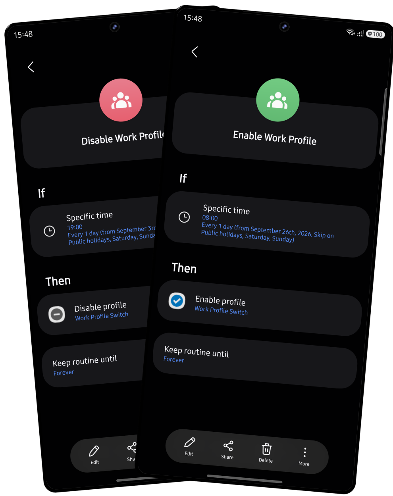

# Work Profile Switch

<p align="center">
  
  
</p>

Lets you turn the **work profile** on/off from a shortcut — so **Samsung Modes
and Routines** can do it automatically on a schedule.

Samsung has a Quick Settings toggle for the work profile, but it can't
be picked as a Routine action. This app just exposes the toggle as two app
shortcuts (`Enable profile` / `Disable profile`) that Routines can target.

<p align="center">
  <a href="https://play.google.com/store/apps/details?id=com.ownik.workprofileswitch"></a>
  <a href="https://github.com/ownik/work-profile-switch-android/releases/latest"></a>
</p>

## Setup

The toggle uses a system permission that needs a one-time manual grant:

```
adb shell pm grant com.ownik.workprofileswitch android.permission.MODIFY_QUIET_MODE
```

No computer? Use [Shizuku](https://shizuku.rikka.app/) instead and grant the
permission through it.

> Reinstalling the app resets the grant — repeat the command above after a
> reinstall (a normal update doesn't reset it).

## Using it with Routines

1. **Modes and Routines** → new routine → condition = your schedule.
2. Action: **Open app** → this app → pick the **Enable profile** or
   **Disable profile** shortcut.
3. Make a second routine for the opposite action/time.

## Known limitation

Enabling the profile only happens once the phone is unlocked — there's no way
around this, it's an Android security restriction (work-profile storage is
encrypted and only decryptable after unlock). So "enable" routines effectively
mean "enable as soon as you next unlock your phone" rather than at the exact
scheduled time. Disabling isn't affected and runs on schedule normally.
